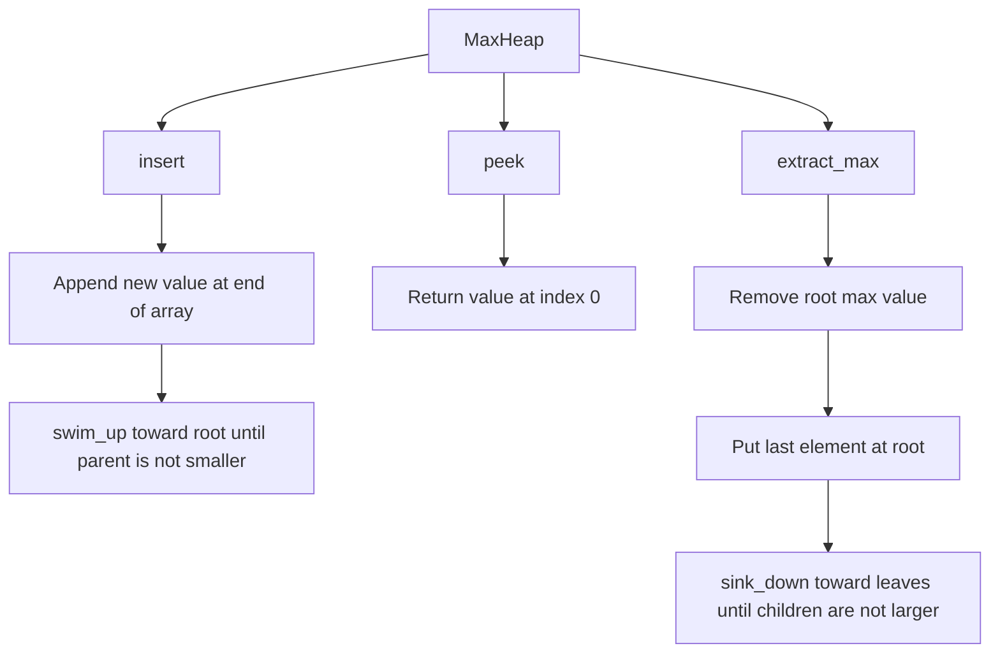
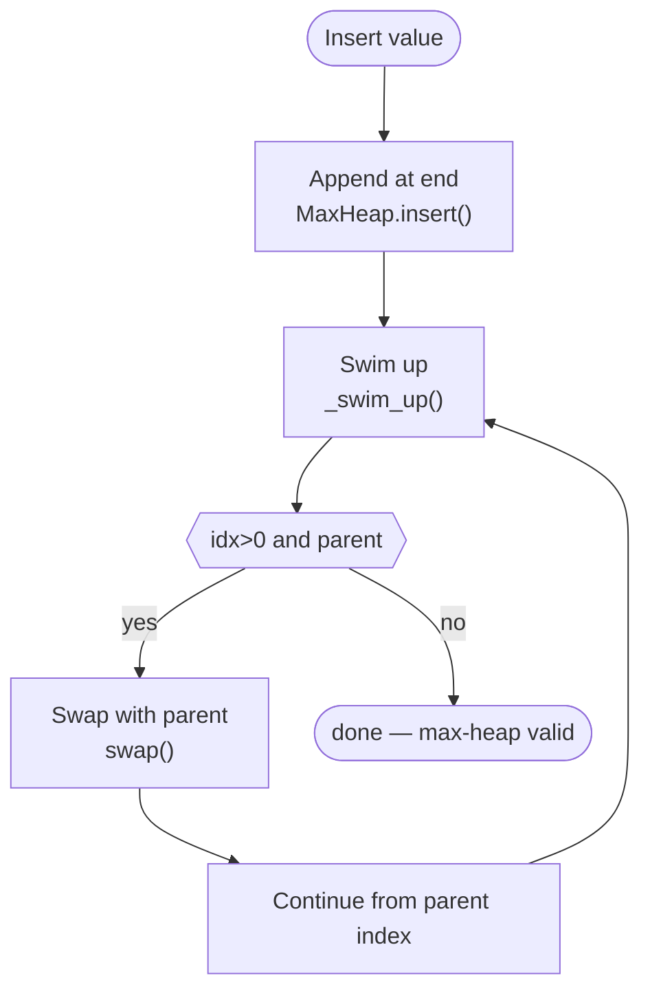
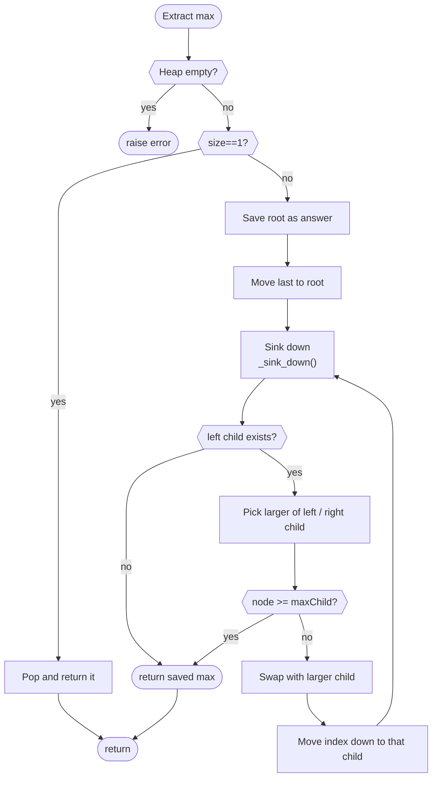
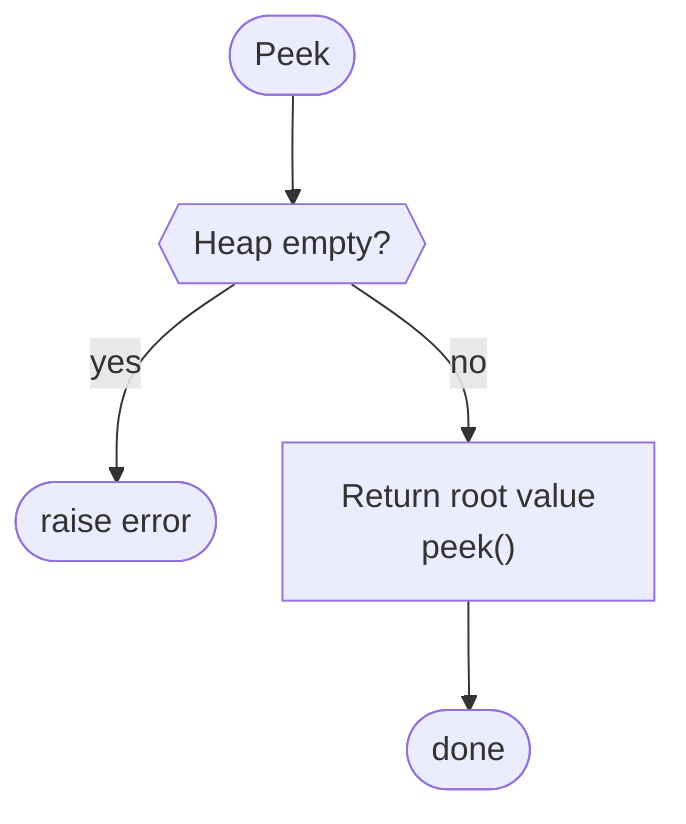
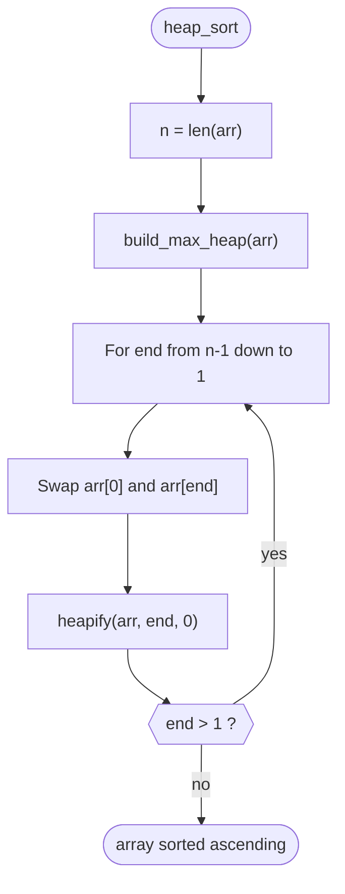
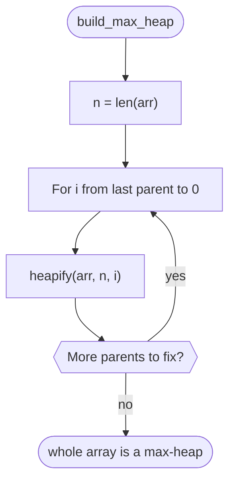
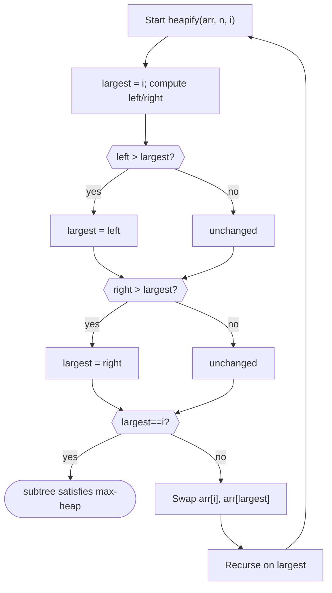
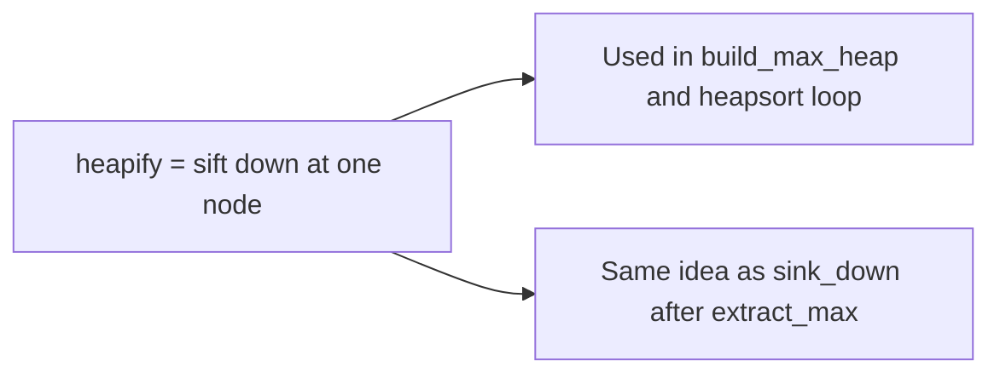

# Heap and heapsort — flow overview

**Max-heap** in an array: `parent(i) = (i-1)//2`, `left(i) = 2i+1`, `right(i) = 2i+2`.  
Implementation: package `heap_heapsort/`; run via `heap_heapsort_project.py` or `python -m heap_heapsort`.

Open this file in **Cursor** or **GitHub** to render the diagrams. For install, outputs, and troubleshooting, see **`README.md`**.

All flowcharts in this file are the canonical source; they are not generated by the Python pipeline.

---

## 1. MaxHeap (`max_heap.py`): insert, extract_max, peek

High-level view of the priority-queue API, then detailed control flow for each operation.

### 1.1 Overview

### 1.2 `insert` → `_swim_up`

### 1.3 `extract_max` → `_sink_down`

### 1.4 `peek`

---

## 2. Heapsort (`heapsort.py`): `heap_sort`, `build_max_heap`, and `heapify`

In-place sort: build a max-heap, then repeatedly move the root maximum to the sorted tail and **heapify** the prefix. **`heapify`** is the shared sift-down step used inside **`build_max_heap`** and after each swap in **`heap_sort`**.

### 2.1 `heap_sort`

### 2.2 `build_max_heap`

### 2.3 `heapify` (sift-down)

### 2.4 Shared idea: `heapify` and `sink_down`

---

## 3. Files in this project

| Topic | Path |
|--------|------|
| Core code | `heap_heapsort/max_heap.py`, `heap_heapsort/heapsort.py` |
| Console demo | `heap_heapsort/demo.py` (`correctness_demo`) |
| Mermaid flowcharts | This file (`heap_heapsort_flowchart.md`) |
| Step PNGs | `diagrams/` |
| Heapsort steps CSV | `tables/heapsort_step_transitions.csv` |
| MaxHeap steps CSV | `tables/maxheap_step_transitions.csv` |
| Index mapping CSV | `tables/heap_index_mapping.csv` |
| Timing and plots | `results/` |
| User guide | `README.md` |

Run: `python heap_heapsort_project.py` (same as `python -m heap_heapsort`).
